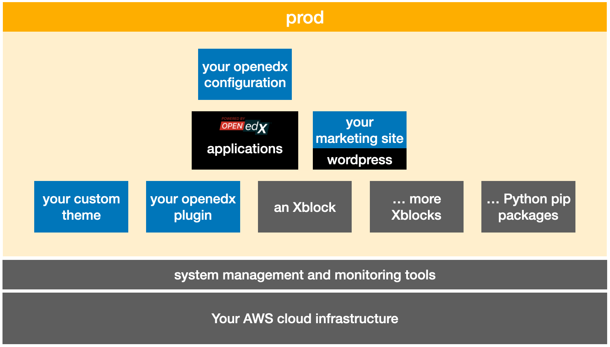

# Welcome to Cookiecutter Open edX

 

We are a community supported organization focused on providing reliable CI automation and system management tools for Open edX:tm: software deployed to Kubernetes with [Tutor](https://docs.tutor.overhang.io/).

## How it works

Powered by [Cookiecutter](https://github.com/cookiecutter/cookiecutter), Cookiecutter Open edX Devops Tools is a community maintained project template for jumpstarting production-ready, [Kubernetes](https://kubernetes.io/)-based installations of the [Open edX](https://openedx.org/) online learning management system running on [AWS](https://aws.amazon.com/) cloud infrastructure that is built and managed with fully parameterized [Terraform](https://www.terraform.io/) and [Github Actions](https://docs.github.com/en/actions) automation scripts.

The cookiecutter project helps you to focus on the pink boxes. It provides as nearly as is possible, "1-click" solutions for the gray and black boxes.

To provide a consistent onboarding experience to new Cookiecutter users we also manage a few other repositories on which the automated build and deployment workflows depend. These include:

- an example [Open edX plugin](https://github.com/cookiecutter-openedx/openedx-plugin-example) that includes working, maintained code samples illustrating how to accomplish various programming and integration tasks.
- an example [Open edX custom theme](https://github.com/cookiecutter-openedx/openedx-theme-example) that provides scaffolding to help you get started with cusomizing the appearance of your open edx platform
- a collection of [tutor plugins](https://docs.tutor.overhang.io/tutorials/plugin.html) that are needed when installing open edx to Kubernetes
- any repositories which we've forked on an interim basis in order to facilitate Kubernetes-specific customizations that were required, and remain pending in their respective upstream repositories.

## Our commitment to the Open edX community

## Our mission and philosophy

## Open edX Github Actions

Don't forget to take a look at our cousin organization [Open edX Github Actions](https://github.com/openedx-actions) where we manage a collection of several dozen actions that are used to create our automated Build and Deploy workflows.
